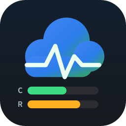
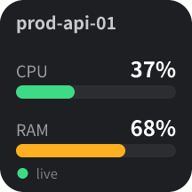
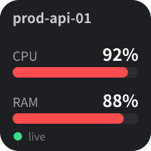
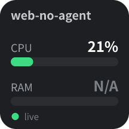
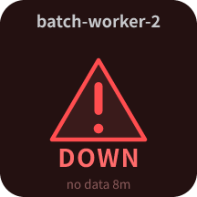
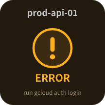
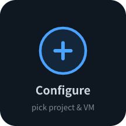

<div align="center">



# GCP Monitor — Ulanzi Studio Plugin

**Live CPU and RAM of a Google Cloud (Compute Engine) VM, right on a key of your Ulanzi macro keypad — with a clear DOWN alert when the machine stops reporting.**

[](LICENSE)


</div>

---

## Overview

**GCP Monitor** turns one key of your Ulanzi Deck (D200 / D200H / D200X and compatible keypads) into a live health tile for a single Google Cloud VM. Each key polls Cloud Monitoring, draws CPU and RAM gauges, and flips to a warning icon the moment the instance goes quiet.

Authentication reuses the `gcloud` CLI you already have installed and logged in — **no OAuth client, no service-account key, no secret is ever stored by the plugin**. You can even switch between multiple logged-in `gcloud` accounts from the key's settings.

## Preview

| Normal | High load | RAM N/A | Down | Error | Setup |
|:---:|:---:|:---:|:---:|:---:|:---:|
|  |  |  |  |  |  |
| CPU + RAM within limits | Gauges turn amber/red | Ops Agent not installed | No data within threshold | Auth / permission / API issue | Not configured yet |

## Features

- **Live CPU and RAM gauges** rendered directly on the key, refreshed on a configurable interval.
- **DOWN alert** — if no CPU sample arrives within your threshold (default **5 min**), the key switches to a warning icon with the data age (`no data 7m`).
- **Color thresholds** — gauges shift from green to amber to red as utilization climbs, so a glance is enough.
- **Multi-account** — pick any account already authenticated in `gcloud auth list`; tokens are cached per account.
- **Cascading pickers** — Account → Project → Instance dropdowns populate automatically in the settings panel.
- **Configurable click action** — a key press either **refreshes every GCP Monitor key at once**, or **opens the VM's monitoring page** in your default browser.
- **Zero stored secrets** — access tokens come from your local `gcloud` on demand and live only in memory.
- **Cross-platform `gcloud` discovery** for Windows and macOS, with a manual path override for non-standard installs.

## How it works

```
Ulanzi Studio  ──WebSocket──▶  plugin/app.js (Node.js)
                                   │
                                   ├─ gcloud CLI ──▶ access token + account/project/instance lists
                                   └─ Cloud Monitoring API v3 ──▶ CPU & RAM time series
                                          │
                                   render.js (SVG ▶ base64) ──▶ setBaseDataIcon() ──▶ key
```

- **CPU** comes from `compute.googleapis.com/instance/cpu/utilization`. This metric is emitted by the hypervisor for every running VM, so its **absence is the signal used to detect a down/unreachable machine**.
- **RAM** comes from `agent.googleapis.com/memory/percent_used` (state `used`). This one is produced by the **Google Cloud Ops Agent**; if the agent is not installed on the VM, RAM simply shows `N/A` — the key is *not* marked down for that reason alone.
- The service queries a 12-minute lookback window and keeps the most recent point. "Freshness" is compared against your **Down after (min)** setting.
- Icons are generated as SVG in Node.js, base64-encoded, and pushed to the key via `setBaseDataIcon` — no image files on disk, no native image libraries.

## Requirements

- **Ulanzi Studio** ≥ 2.1.4 (Windows or macOS).
- **Google Cloud SDK (`gcloud`)** installed and authenticated on the same machine (`gcloud auth login`).
- The VM lives in **Compute Engine**, and you know (or can pick) its project.
- **IAM permissions** for the account you select:
  - `roles/monitoring.viewer` — read CPU/RAM time series.
  - `roles/compute.viewer` — list instances (to populate the Instance dropdown).
- **APIs enabled** in the project:
  - Cloud Monitoring API (`monitoring.googleapis.com`)
  - Compute Engine API (`compute.googleapis.com`)
- **RAM only:** the [Ops Agent](https://cloud.google.com/monitoring/agent/ops-agent/install-index) installed on the target VM.

## Installation

### Option A — install the packaged plugin (recommended)

1. Download `com.ulanzi.gcpmonitor.ulanziPlugin.zip` from the [Releases](../../releases) page.
2. Unzip it and copy the `com.ulanzi.gcpmonitor.ulanziPlugin` folder into your Ulanzi Studio **plugins** directory (the same folder where your other plugins live). On Windows this is typically:
   ```
   %APPDATA%\Ulanzi\UlanziStudio\plugins\
   ```
3. Restart Ulanzi Studio. "GCP Monitor" appears in the actions list; drag **VM CPU / RAM** onto a key.

### Option B — build from source

```bash
git clone https://github.com/beyondlevi/gcp-monitor-ulanzi-plugin.git
cd gcp-monitor-ulanzi-plugin

# Produces com.ulanzi.gcpmonitor.ulanziPlugin.zip with runtime deps bundled
./scripts/package.sh
```

Then follow steps 2–3 above with the generated zip.

> The plugin ships a small vendored copy of the official UlanziDeck JS SDK (see [Third-party](#third-party)). Its only runtime dependency is [`ws`](https://www.npmjs.com/package/ws), installed by the packaging script.

## Configuration

Select the key, then use the property inspector on the right:

| Setting | Description | Default |
|---|---|---|
| **Account** | Which `gcloud` account to use (from `gcloud auth list`). The active account is preselected. | active account |
| **Project** | GCP project that owns the VM. | — |
| **Instance** | The Compute Engine instance to monitor. | — |
| **Refresh (s)** | Polling interval in seconds (minimum 10). | `30` |
| **Down after (min)** | If no CPU sample is newer than this, show the DOWN icon. | `5` |
| **On click** | Key-press behavior — see [Click actions](#click-actions). | Refresh all data |
| **Advanced ▸ gcloud path** | Absolute path to the `gcloud` binary. Leave empty to auto-detect. | auto-detect |

Use **Reload lists** to re-read accounts, projects, and instances (e.g. after `gcloud auth login`).

### Click actions

- **Refresh all data** — refreshes *every* GCP Monitor key on your deck at once. Handy for an at-a-glance fleet check.
- **Open details in browser** — opens the VM's Cloud Console monitoring page in your default browser, e.g.:
  ```
  https://console.cloud.google.com/compute/instancesDetail/zones/<zone>/instances/<name>?project=<project>&tab=monitoring
  ```

### Multiple accounts

The plugin reads every logged-in account from `gcloud auth list`. Pick one per key, and tokens are cached separately per account (≈50 min, auto-refreshed). Different keys can watch VMs from different accounts and projects simultaneously.

## Authentication & security

- Tokens are obtained on demand via `gcloud auth print-access-token [--account=...]` and held **in memory only**.
- The plugin never stores, logs, or transmits your credentials — it delegates entirely to your local `gcloud`.
- On `401/403` the cached token for that account is invalidated and refreshed on the next poll.

## Troubleshooting

| Symptom on the key | Likely cause | Fix |
|---|---|---|
| `gcloud not found` | SDK not on PATH (common on macOS GUI apps) | Set **Advanced ▸ gcloud path**, or the `GCP_MONITOR_GCLOUD` env var, to the absolute binary path |
| `run gcloud auth login` | No/expired credentials for the account | Run `gcloud auth login`, then **Reload lists** |
| `permission denied` | Missing IAM role | Grant `roles/monitoring.viewer` (+ `roles/compute.viewer` to list instances) |
| `monitoring API off` | Cloud Monitoring API disabled | Enable `monitoring.googleapis.com` in the project |
| `project not found` | Wrong project / no access | Reselect the project for the chosen account |
| RAM shows `N/A` | Ops Agent not installed | Install the Ops Agent on the VM (CPU keeps working regardless) |
| Key shows DOWN but VM is up | Threshold too tight or metrics lag | Increase **Down after (min)** |

## Development

```
com.ulanzi.gcpmonitor.ulanziPlugin/
├── manifest.json                 # Plugin & action metadata (UUIDs, paths)
├── package.json                  # Node service manifest (dep: ws)
├── en.json                       # UI localization (English)
├── plugin/
│   ├── app.js                    # Main service: SDK events, routing, refreshAll hook
│   ├── actions/MachineAction.js  # Per-key logic: polling, state machine, click action
│   ├── gcp/gcloud.js             # gcloud discovery, auth, account/project/instance lists
│   ├── gcp/monitoring.js         # Cloud Monitoring API v3 queries
│   ├── gcp/render.js             # SVG icon rendering for every state
│   └── plugin-common-node/       # Vendored UlanziDeck SDK (Node)
├── property-inspector/machine/   # Settings UI (HTML + JS)
├── libs/                         # Vendored UlanziDeck SDK (browser side)
└── assets/icons/                 # Plugin / category / action icons
```

- **Language:** modern JavaScript (ES modules), functional and modular by design.
- **Main service:** Node.js (chosen so it can shell out to `gcloud` and render SVGs — neither is possible from an HTML-only service).
- **Repackage** after changes: `./scripts/package.sh`.
- **Live logs:** run Ulanzi Studio and inspect the Node service via the `--inspect` port declared in `manifest.json`.

## Third-party

This project bundles a copy of the official **UlanziDeck JS Plugin SDK** under `libs/` and `plugin/plugin-common-node/`. That SDK is distributed by Ulanzi under the **Apache-2.0** license and retains its original headers. All first-party code in this repository is released under the MIT license below.

## License

[MIT](LICENSE) © 2026 beyondlevi

> Not affiliated with or endorsed by Google or Ulanzi. "Google Cloud" and "Ulanzi" are trademarks of their respective owners.
